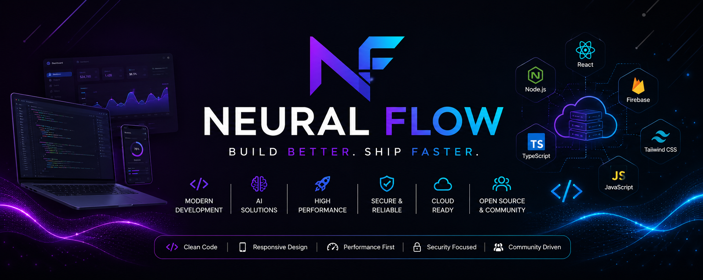

  

# 🚀 Neural Flow

### Build Better. Ship Faster.

**Modern Web Applications • AI Solutions • Open Source • Developer Tools**

Building modern software with simplicity, performance, and exceptional user experience.

---

# 🌟 About Neural Flow

Neural Flow is a software development organization dedicated to building modern, scalable, and production-ready software.

We develop high-quality web applications, SaaS platforms, AI-powered solutions, and business management systems using clean architecture, responsive design, and modern technologies.

---

# 🚀 Our Mission

Our mission is to empower businesses, developers, and communities through innovative software that is fast, secure, reliable, and easy to use.

---

# 🛠️ What We Build

### 🌐 Websites

- Business Websites
- Corporate Websites
- Portfolio Websites
- Landing Pages

### 🛒 eCommerce Solutions

- Online Stores
- Admin Dashboards
- Inventory Management
- Order Management Systems

### 📡 ISP Solutions

- ISP Management Systems
- Customer Portals
- Billing Platforms
- Network Administration

### 🤖 AI Solutions

- AI Assistants
- Workflow Automation
- AI Integrations
- Productivity Tools

### 📱 Web Applications

- Progressive Web Apps (PWA)
- SaaS Platforms
- Business Management Systems
- Internal Enterprise Tools

---

# 💻 Technology Stack

## Frontend

- HTML5
- CSS3
- JavaScript
- TypeScript

## Backend

- Node.js
- Firebase

## Database

- Cloud Firestore
- Firebase Storage

## Development Tools

- Git
- GitHub
- VS Code
- Cursor
- Claude Code

---

# 📂 Featured Projects

Some of the solutions developed under Neural Flow include:

- 🌐 Business Websites
- 🛒 eCommerce Platforms
- 📡 ISP Management Systems
- 📚 Educational Platforms
- 🍽️ Restaurant Management Systems
- 🏥 Healthcare Solutions
- 🤖 AI Applications
- 📊 Admin Dashboards

> More exciting projects are coming soon.

---

# ✨ Development Principles

- ⚡ Performance First
- 🎨 Modern UI/UX
- 🔒 Security by Design
- 📱 Mobile-First Responsive Design
- ☁️ Cloud Ready
- ♿ Accessibility
- 📈 Scalable Architecture
- 🚀 Production-Ready Quality

---

# ❤️ Open Source

We believe in learning by building and sharing.

Selected Neural Flow projects are open source to support developers, students, and the broader community.

We welcome ideas, issues, discussions, and pull requests.

---

# 📈 Current Focus

- Modern Web Development
- AI Integration
- Firebase Ecosystem
- Progressive Web Apps
- SaaS Platforms
- Open Source Projects

---

# 🤝 Contributing

We welcome contributions from the community.

1. Fork the repository.
2. Create a feature branch.
3. Commit your changes.
4. Push your branch.
5. Open a Pull Request.

Please follow the project's coding standards and write clear commit messages.

---

# 📬 Connect With Us

**GitHub Organization**

https://github.com/neuralflow-bd

---

### 🚀 Build Better. Ship Faster.

Made with ❤️ by **Neural Flow**

